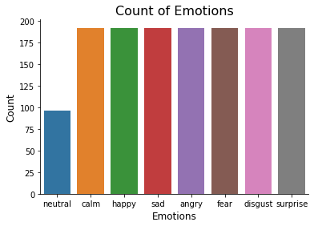

# Project status
Finished but open to eventual improvement or updates.

# Speech emotion recognition

In this work i propose a speech emotion recognition model based on the extraction of four different features got from sound files and stackingthe resulting matrices in a one-dimensional array by taking the mean values along the time axis. Then this array is fed into a 1-D CNN model as input.


# Table of contents

- [Installation and usage](#installation-and-usage)
- [Contributing](#contributing)
- [Dataset](#dataset)
- [Results](#results)
- [Contact](#contact)


# Installation and usage

## For Colab
You can run this code entirely on Colab without the need of libraries installation through pip.

## For Linux/Ubuntu/...
All the libraries used are easy downloadable, but i recommend the creation of a conda environment thourgh the .yml file that you can find in the repo. It contains everything you need.

1. Create the conda environment
     ```sh
     conda env create -f SEC_environment.yml
     ```
2. Activate the conda environment
     ```sh
     conda activate SEC_environment
     ```
1. For training and testing, just run:
     ```sh
     python train_and_test.py
     ```
The first line of the yml file sets the new environment's name, that's already set on SEC_environment.

## Contributing

Contributions are what make the open source community such an amazing place to learn, inspire, and create. Any contributions you make are **greatly appreciated**.

If you have a suggestion that would make this better, please fork the repo and create a pull request. You can also simply open an issue with the tag "enhancement".
Don't forget to give the project a star! Thanks again!

1. Fork the Project
2. Create your Feature Branch (`git checkout -b feature/AmazingFeature`)
3. Commit your Changes (`git commit -m 'Add some AmazingFeature'`)
4. Push to the Branch (`git push origin feature/AmazingFeature`)
5. Open a Pull Request

## Dataset
The dataset used for this work is the [Ryerson Audio-Visual Database of Emotional Speech and Song](https://smartlaboratory.org/ravdess/) (RAVDESS). This dataset contains audio and visual recordings of 12 male and 12 female actors pronouncing English sentences with eight different emotional expressions. For this task, we utilize only speech samples from the database with the following eight different emotion classes: sad, happy, angry, calm, fearful, surprised, neutral and disgust.



The overall number of utterances pronounced in audio files is 1440.


## Results
The results of this work were compared with different documents using deep and non-deep approaches. Of course, all of these jobs also use the same data set, the RAVDESS.

| **Paper**             	| **Accuracy** 	|
|-----------------------	|--------------	|
| [Shegokar and Sircar](https://ieeexplore.ieee.org/document/7843306)   	| 60.10%        	|
| [Zeng et al.](https://link.springer.com/article/10.1007/s11042-017-5539-3)           	| 65.97%        	|
| [Livingstone and Russo](https://journals.plos.org/plosone/article?id=10.1371/journal.pone.0196391) 	| 67.00%        	|
| [Dias Issa et al.](https://www.sciencedirect.com/science/article/pii/S1746809420300501)      	| 71.61%        	|
| This work             	| 80.11%        	|

<!-- CONTACT -->
## Contact

Andrea Lombardi - [@LinkedIn](https://www.linkedin.com/in/andrea-lombardi/)
